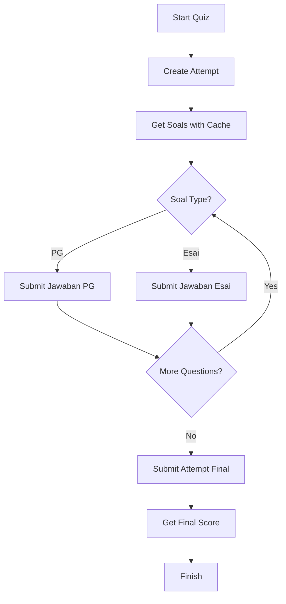

# 📚 Dokumentasi API LogiLearn Mobile

> Dokumentasi lengkap untuk semua endpoint API yang digunakan dalam aplikasi LogiLearn Mobile.

---

## 📋 Daftar Isi

- [Base URL & Authentication](#base-url--authentication)
- [1. Authentication Endpoints](#1-authentication-endpoints)
- [2. Profile Endpoints](#2-profile-endpoints)
- [3. Section & Level Endpoints](#3-section--level-endpoints)
- [4. Attempt Endpoints](#4-attempt-endpoints)
- [5. Error Handling](#5-error-handling)
- [6. Fitur Tambahan](#6-fitur-tambahan)
- [7. Flow Quiz](#7-flow-quiz)
- [8. Catatan Penting](#8-catatan-penting)

---

## Base URL & Authentication

# Base URL

| Platform | URL |
|----------|-----|
| **Web** | `http://localhost:3030/api` |
| **Android Emulator** | `http://10.0.2.2:3030/api` |
| **iOS/Desktop** | `http://localhost:3030/api` |

# Authentication

Semua endpoint (kecuali auth) memerlukan header berikut:

```http
Authorization: Bearer {token}
Content-Type: application/json
```

> **Note**: Token disimpan menggunakan `flutter_secure_storage` dengan key `token`.

---

## 1. Authentication Endpoints

# 1.1 Login Pelajar

**`POST`** `/api/auth/login-pelajar`

Mengautentikasi pelajar dan mendapatkan token akses.

# Headers

| Key | Value |
|-----|-------|
| `Content-Type` | `application/json` |

# Request Body

```json
{
  "username": "string",
  "password": "string"
}
```

# Response Success (200)

```json
{
  "payload": {
    "datas": {
      "token": "string",
      "pelajar": {
        "id": "integer",
        "nama": "string",
        "username": "string"
      }
    },
    "message": "string"
  }
}
```

# Response Error

| Status Code | Description |
|-------------|-------------|
| `400` | Bad Request |
| `401` | Unauthorized |

# Fitur

- ✅ Otomatis menyimpan `token`, `id_pelajar`, dan `nama_pelajar` ke secure storage

---

# 1.2 Register Pelajar

**`POST`** `/api/auth/register-pelajar`

Mendaftarkan pelajar baru ke sistem.

# Headers

| Key | Value |
|-----|-------|
| `Content-Type` | `application/json` |

# Request Body

```json
{
  "nama": "string",
  "username": "string",
  "password": "string"
}
```

# Validasi

| Field | Aturan |
|-------|--------|
| **Username** | - Minimal 4 karakter<br>- Tidak boleh mengandung spasi |
| **Password** | - Minimal 8 karakter<br>- Harus mengandung minimal 1 huruf kapital<br>- Harus mengandung minimal 1 angka |

# Response Success (201)

```json
{
  "payload": {
    "message": "string"
  }
}
```

# Response Error

| Status Code | Description |
|-------------|-------------|
| `400` | Bad Request (validasi gagal) |
| `409` | Conflict (username sudah terdaftar) |

---

## 2. Profile Endpoints

# 2.1 Get Profile

**`GET`** `/api/profile`

Mendapatkan informasi profil pelajar yang sedang login.

# Headers

| Key | Value |
|-----|-------|
| `Authorization` | `Bearer {token}` |
| `Content-Type` | `application/json` |

# Response Success (200)

```json
{
  "payload": {
    "datas": {
      "id": "integer",
      "nama": "string",
      "username": "string",
      "email": "string"
    }
  }
}
```

---

# 2.2 Change Password

**`PUT`** `/api/profile/change-password`

Mengubah password pelajar.

# Headers

| Key | Value |
|-----|-------|
| `Authorization` | `Bearer {token}` |
| `Content-Type` | `application/json` |

# Request Body

```json
{
  "oldPassword": "string",
  "newPassword": "string"
}
```

# Response Success (200)

```json
{
  "payload": {
    "message": "string"
  },
  "message": "string"
}
```

# Response Error

| Status Code | Description |
|-------------|-------------|
| `400` | Bad Request (password lama salah) |
| `401` | Unauthorized |

---

## 3. Section & Level Endpoints

# 3.1 Get All Sections

**`GET`** `/api/sections`

Mendapatkan daftar semua section yang tersedia.

# Headers

| Key | Value |
|-----|-------|
| `Authorization` | `Bearer {token}` |
| `Content-Type` | `application/json` |

# Response Success (200)

```json
{
  "payload": {
    "datas": [
      {
        "id": "integer",
        "nama": "string",
        "slug": "string",
        "deskripsi": "string"
      }
    ]
  }
}
```

---

# 3.2 Get Levels by Section

**`GET`** `/api/{slugSection}/levels`

Mendapatkan daftar level berdasarkan section.

# Headers

| Key | Value |
|-----|-------|
| `Authorization` | `Bearer {token}` |
| `Content-Type` | `application/json` |

# Path Parameters

| Parameter | Type | Description |
|-----------|------|-------------|
| `slugSection` | `string` | Slug dari section |

# Response Success (200)

```json
{
  "payload": {
    "datas": [
      {
        "id": "integer",
        "nama": "string",
        "nomor": "integer",
        "is_unlocked": "boolean"
      }
    ]
  }
}
```

---

# 3.3 Get Level by ID

**`GET`** `/api/{slugSection}/levels/{levelId}`

Mendapatkan detail level berdasarkan ID.

# Headers

| Key | Value |
|-----|-------|
| `Authorization` | `Bearer {token}` |
| `Content-Type` | `application/json` |

# Path Parameters

| Parameter | Type | Description |
|-----------|------|-------------|
| `slugSection` | `string` | Slug dari section |
| `levelId` | `integer` | ID dari level |

# Response Success (200)

```json
{
  "payload": {
    "datas": {
      "id": "integer",
      "nama": "string",
      "nomor": "integer",
      "is_unlocked": "boolean"
    }
  }
}
```

---

# 3.4 Get Soals by Level

**`GET`** `/api/{slugSection}/levels/{levelId}/soal`

Mendapatkan daftar soal berdasarkan level.

# Headers

| Key | Value |
|-----|-------|
| `Authorization` | `Bearer {token}` |
| `Content-Type` | `application/json` |

# Path Parameters

| Parameter | Type | Description |
|-----------|------|-------------|
| `slugSection` | `string` | Slug dari section |
| `levelId` | `integer` | ID dari level |

# Response Success (200)

```json
{
  "payload": {
    "datas": [
      {
        "id": "integer",
        "text_soal": "string",
        "tipe": "string",
        "opsis": [
          {
            "id": "integer",
            "text_opsi": "string",
            "is_correct": "boolean"
          }
        ]
      }
    ]
  }
}
```

> **Note**: Field `tipe` bisa berisi `"pg"` atau `"esai"`. Field `is_correct` juga bisa bernama `is_benar`.

# Fitur Caching

| Fitur | Deskripsi |
|-------|-----------|
| **Auto-save** | Soal otomatis disimpan ke local storage (SharedPreferences) setelah fetch |
| **Auto-load** | Jika cache tersedia, akan langsung return dari cache tanpa request ke API |
| **Fallback** | Jika API error, akan fallback ke cache jika tersedia |
| **Cache Key** | Format: `soal_cache_{slugSection}_{levelId}` |

# Parameter Opsional (di ApiService)

| Parameter | Type | Default | Description |
|-----------|------|---------|-------------|
| `useCache` | `boolean` | `true` | Gunakan cache atau tidak |
| `forceRefresh` | `boolean` | `false` | Force refresh dari API |

---

## 4. Attempt Endpoints

# 4.1 Create Attempt

**`POST`** `/api/attempts`

Membuat attempt baru untuk memulai quiz.

# Headers

| Key | Value |
|-----|-------|
| `Authorization` | `Bearer {token}` |
| `Content-Type` | `application/json` |

# Request Body

```json
{
  "id_level": "integer"
}
```

# Response Success (200/201)

```json
{
  "payload": {
    "datas": {
      "id": "integer",
      "id_level": "integer",
      "id_pelajar": "integer",
      "status": "string"
    }
  }
}
```

# Catatan

- ✅ Attempt ID disimpan untuk digunakan pada submit jawaban
- ⚠️ Response bisa dalam format berbeda, aplikasi mengecek beberapa kemungkinan struktur:
  - `payload.datas.id`
  - `id` (langsung)
  - `data.id`

---

# 4.2 Submit Jawaban PG (Pilihan Ganda)

**`POST`** `/api/attempts/{attemptId}/jawaban-pg`

Menyimpan jawaban pilihan ganda untuk soal tertentu.

# Headers

| Key | Value |
|-----|-------|
| `Authorization` | `Bearer {token}` |
| `Content-Type` | `application/json` |

# Path Parameters

| Parameter | Type | Description |
|-----------|------|-------------|
| `attemptId` | `integer` | ID dari attempt |

# Request Body

```json
{
  "idOpsi": "integer"
}
```

# Response Success (200/201)

```json
{
  "payload": {
    "datas": {
      "id": "integer",
      "id_attempt": "integer",
      "id_opsi": "integer"
    }
  }
}
```

# Fitur

- ✅ Submit berjalan di background tanpa blocking UI
- ✅ Tidak ada loading indicator saat submit

---

# 4.3 Submit Jawaban Esai

**`POST`** `/api/attempts/{attemptId}/jawaban-esai/{soalId}`

Menyimpan jawaban esai untuk soal tertentu.

# Headers

| Key | Value |
|-----|-------|
| `Authorization` | `Bearer {token}` |
| `Content-Type` | `application/json` |

# Path Parameters

| Parameter | Type | Description |
|-----------|------|-------------|
| `attemptId` | `integer` | ID dari attempt |
| `soalId` | `integer` | ID dari soal |

# Request Body

```json
{
  "jawaban": "string"
}
```

# Response Success (200/201)

```json
{
  "payload": {
    "datas": {
      "id": "integer",
      "id_attempt": "integer",
      "id_soal": "integer",
      "jawaban": "string"
    }
  }
}
```

# Fitur

- ✅ Submit berjalan di background tanpa blocking UI
- ✅ Tidak ada loading indicator saat submit

---

# 4.4 Submit Attempt (Finalize)

**`POST`** `/api/attempts/submit`

Menyelesaikan attempt dan mendapatkan skor final.

# Headers

| Key | Value |
|-----|-------|
| `Authorization` | `Bearer {token}` |
| `Content-Type` | `application/json` |

# Request Body

```json
{
  "id_attempt": "integer"
}
```

# Response Success (200)

```json
{
  "payload": {
    "datas": {
      "id": "integer",
      "skor": "string",
      "status": "string"
    }
  }
}
```

> **Note**: Field `skor` bisa berupa angka atau string.

# Catatan

- ✅ Endpoint ini dipanggil saat user menyelesaikan semua soal
- ✅ Mengembalikan skor final dari attempt
- ⚠️ Response bisa dalam format berbeda, aplikasi mengecek:
  - `payload.datas.skor`
  - `skor` (langsung)

---

# 4.5 Get All Attempts

**`GET`** `/api/attempts`

Mendapatkan daftar semua attempt.

# Headers

| Key | Value |
|-----|-------|
| `Authorization` | `Bearer {token}` |
| `Content-Type` | `application/json` |

# Query Parameters (Opsional)

| Parameter | Type | Description |
|-----------|------|-------------|
| `level_id` | `integer` | Filter attempts berdasarkan level |

# Response Success (200)

```json
{
  "payload": {
    "datas": [
      {
        "id": "integer",
        "id_level": "integer",
        "id_pelajar": "integer",
        "skor": "string",
        "status": "string",
        "created_at": "string"
      }
    ]
  }
}
```

---

# 4.6 Get Attempt by ID

**`GET`** `/api/attempts/{attemptId}`

Mendapatkan detail attempt berdasarkan ID.

# Headers

| Key | Value |
|-----|-------|
| `Authorization` | `Bearer {token}` |
| `Content-Type` | `application/json` |

# Path Parameters

| Parameter | Type | Description |
|-----------|------|-------------|
| `attemptId` | `integer` | ID dari attempt |

# Response Success (200)

```json
{
  "payload": {
    "datas": {
      "id": "integer",
      "id_level": "integer",
      "id_pelajar": "integer",
      "skor": "string",
      "status": "string",
      "jawaban_pg": [],
      "jawaban_esai": [],
      "created_at": "string"
    }
  }
}
```

---

# 4.7 Get Attempts by Pelajar ID

**`GET`** `/api/attempts/pelajar/{pelajarId}`

Mendapatkan daftar attempt berdasarkan ID pelajar.

# Headers

| Key | Value |
|-----|-------|
| `Authorization` | `Bearer {token}` |
| `Content-Type` | `application/json` |

# Path Parameters

| Parameter | Type | Description |
|-----------|------|-------------|
| `pelajarId` | `integer` | ID dari pelajar |

# Response Success (200)

```json
{
  "payload": {
    "datas": [
      {
        "id": "integer",
        "id_level": "integer",
        "id_pelajar": "integer",
        "skor": "string",
        "status": "string",
        "created_at": "string"
      }
    ]
  }
}
```

---

## 5. Error Handling

# Format Error Response

Semua endpoint mengembalikan error dalam format berikut:

```json
{
  "message": "string",
  "error": "string"
}
```

> **Note**: Field `error` bersifat opsional.

# Status Code

| Status Code | Description |
|-------------|-------------|
| `200` | ✅ Success |
| `201` | ✅ Created |
| `400` | ❌ Bad Request |
| `401` | ❌ Unauthorized |
| `403` | ❌ Forbidden |
| `404` | ❌ Not Found |
| `500` | ❌ Internal Server Error |

---

## 6. Fitur Tambahan

# 6.1 Caching System

Sistem caching untuk optimasi performa dan pengalaman pengguna.

| Aspek | Detail |
|-------|--------|
| **Lokasi** | SharedPreferences |
| **Key Format** | `soal_cache_{slugSection}_{levelId}` |
| **Auto-save** | ✅ Setelah fetch dari API |
| **Auto-load** | ✅ Jika cache tersedia |
| **Fallback** | ✅ Ke cache jika API error |
| **Force Refresh** | ✅ Tersedia via parameter |

# 6.2 Secure Storage

Data sensitif disimpan menggunakan `flutter_secure_storage`:

| Key | Description |
|-----|-------------|
| `token` | JWT token untuk authentication |
| `id_pelajar` | ID pelajar yang sedang login |
| `nama_pelajar` | Nama pelajar yang sedang login |

# 6.3 Background Submission

Fitur untuk meningkatkan user experience:

- ✅ Submit jawaban (PG dan Esai) berjalan di background
- ✅ Tidak memblokir UI saat submit
- ✅ Tidak ada loading indicator saat submit jawaban per soal
- ✅ Loading hanya muncul saat:
  - Initial load quiz
  - Submit attempt final

---

## 7. Flow Quiz

Alur lengkap untuk mengerjakan quiz:



# Langkah-langkah:

1. **Create Attempt**
   ```
   POST /api/attempts
   Body: { "id_level": integer }
   ```

2. **Get Soals** (dengan cache)
   ```
   GET /api/{slugSection}/levels/{levelId}/soal
   ```

3. **Submit Jawaban**
   - **PG**: `POST /api/attempts/{attemptId}/jawaban-pg`
   - **Esai**: `POST /api/attempts/{attemptId}/jawaban-esai/{soalId}`

4. **Submit Attempt** (saat selesai semua soal)
   ```
   POST /api/attempts/submit
   Body: { "id_attempt": integer }
   ```

---

## 8. Catatan Penting

# 🔐 Token Management

- Token harus selalu disertakan di header `Authorization` untuk semua endpoint (kecuali auth)
- Token disimpan secara aman menggunakan `flutter_secure_storage`
- Token akan otomatis dihapus saat logout

# 📦 Response Format

- Backend menggunakan format `payload.datas` untuk response sukses
- Aplikasi menangani berbagai format response untuk kompatibilitas
- Beberapa endpoint memiliki struktur response yang fleksibel

# ⚠️ Error Handling

- Aplikasi menangani berbagai format response untuk kompatibilitas
- Error handling yang robust dengan fallback ke cache jika tersedia
- User-friendly error messages

# 💾 Caching

- Cache soal otomatis, tidak perlu manual clear (kecuali force refresh)
- Cache key menggunakan format: `soal_cache_{slugSection}_{levelId}`
- Cache akan otomatis di-update setelah fetch dari API

# 🚀 Background Operations

- Submit jawaban tidak blocking, user experience lebih smooth
- Tidak ada loading indicator yang mengganggu saat submit jawaban per soal
- Loading hanya muncul saat operasi yang benar-benar membutuhkan waktu

---

## 📝 Informasi Dokumentasi

| Item | Detail |
|------|--------|
| **Aplikasi** | LogiLearn Mobile Application |
| **Versi** | 1.0.0 |
| **Terakhir Diupdate** | 2025 |
| **Base URL** | `http://localhost:3030/api` |

---

**Dibuat dengan ❤️ untuk LogiLearn Mobile**
